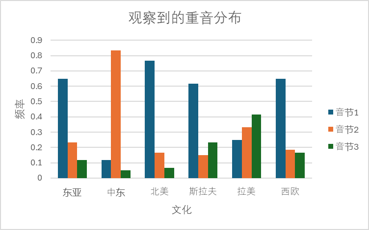

# 更新过的

## 摘要

## 介绍

### RQ

面对外来文化的名字时，英语用户的认读是否存在文化特异的语音学偏好？
若有，是哪些？

## 相关工作

## 方法

本研究的设计为 within-sample 的真实验；实验对象均为随机选取。
通过令实验对象尝试认读外来文化的名字，我们可以从中分析提取语音特征，进而识别特定语音特征与特定文化之间的统计显著联系。

为了避免名字的固有影响，我们特意挑选了世界文化中较为小众、拉丁转写拼读较为模糊的名字。
我们采用 AI 生成各文化中的“典型面孔”人像，与名字一同展示给实验对象，以在文化层面上给予暗示。
名字与人像之间的对应是随机分配的，因为我们期望看到与具体名字无关的语音学偏好——即，不论名字如何，只要文化不变，我们都期望观察到相同的语音学偏好。

### 准备材料

- 确定要作为研究目标的文明列表；
- 搜罗各文明中读音、正字较为模糊的名字；
- AI 生成与各文明相对应的人像若干；
- 开发用于现场调查的交互式应用。

### 现场调查收集数据

在城市各处随机抓人进行现场采访调查。

对每次采访，随机生成若干组【名字-人像】的配对，依次展示给采访对象。
采访对象需尝试拼读该名字，其语音将会被记录在采访设备中。
拼读完一组配对后，展示下一组配对。
直至所有配对拼读完成，本次采访结束。

采访中产生的【名字-人像-读音】三元组是数据记录的最小单位。
每次采访所产生的若干三元组将会以匿名方式收集起来，以供后续分析。

### 语音分析提取特征

我们对每条数据中的读音进行语音分析，并提取其具有语音学意义的特征。
此步骤可视作其他研究中的 coding 环节。

可提取的特征列表如下（待扩充）：

| 特征类别 | 意义 | 取值 |
| --- | --- | --- |
| 重音位置 | 实现于第几个音节首 | 0-N（N 为音节数） & N/A（无重音） |
| 次重音位置 | 同上 | 同上 |
| 正字实现 | 某字母序列实现为某音素 | (正字序列, 音素) |
| 央化/弱读 | 某元音弱读为央元音 | 正字序列 |
| 合字 | 某字母序列被识别为合字 | (正字序列) |

### 数值分析识别显著特征

提取完特征后，可以将每种语音特征的**每种结果**的频数与对应的文化列成二维直方图，以便分析其分布。
但是，由于不同类别的特征的取值意义不同，需要按类别分别处理。

以重音位置为例，假设以下为直接从数据中得来的直方图：

| 重音位置\文化 | 东亚 | 中东 | 北美 | 斯拉夫 | 拉美 | 西欧 |
| --- | --- | --- | --- | --- | --- | --- |
| 0 | 39 | 7 | 46 | 37 | 15 | 39 |
| 1 | 14 | 50 | 10 | 9 | 20 | 11 |
| 2 | 7 | 3 | 4 | 14 | 25 | 10 |

可能这样还不够直观，因为不同文化的样本总数可能不同，无法直接比较，还需要更进一步归一化。

<center>

</center>

这里只是做一个示范，实际上由于每个名字的音节数不同，或许还需要按音节长度再次归一化，得到的就不仅仅是一个简单的柱状图了，而是 X-Y 散点图；
虽然更复杂了，但是能适用的统计分析方法看起来就更高级了，不是坏事。

总之经过归一化之后，可以明显看出：
- 中东名字的重音明显集中于第二个音节；
- 拉美名字的重音也有后移的趋势。

那么如何用数据分析来支持这一点呢？
我刚发现 Student's t test 不足以为政，因为它只能用于检验两个样本「均值差异是否足够大」;
在这里，我们希望检验的是两个样本「是否并非服从相同的分布」，而 Kolmogorov-Smirnov test 就是干这个的；
如果待检验的因变量并非连续变量，则需要采用卡方分布。

如下 R 代码可给出每一行数据与其他数据有多“相似”。

```R
# Example data: columns are categories
data <- data.frame(
	A = c(1.2, 2.3, 3.4, 4.5, 5.6),
	B = c(1.1, 2.1, 3.5, 4.6, 5.5),
	C = c(1.0, 2.0, 3.0, 4.0, 5.0),
	D = c(1.0, 2.0, 3.0, 4.0, 5.0),
	E = c(1.0, 2.0, 3.0, 4.0, 5.0),
	F = c(1.0, 2.0, 3.0, 4.0, 5.0),
	G = c(1.0, 2.0, 3.0, 4.0, 5.0),
	H = c(1.0, 2.0, 3.0, 4.0, 5.0)
)

# Initialize a matrix to store p-values
results <- data.frame(Column = colnames(data), ks = NA)

# Loop through each column
for (i in 1:ncol(data)) {
	# Perform KS test
	results$ks[i] <- ks.test(
		data[[i]], # Current column
		unlist(data[-i]) # Union of all other columns
	)$p.value
}

# Display the results
print(results)
```

最后给出的答案：

```
  Column         ks
1      A 0.09549732
2      B 0.12567628
3      C 0.97548966
4      D 0.97548966
5      E 0.97548966
6      F 0.97548966
7      G 0.97548966
8      H 0.97548966
```

可以看到，只有 1、2 两行的相似度甚低，符合预期。

## 结果

## 讨论

对识别出来的显著特征按文化分别讨论。

## 改善